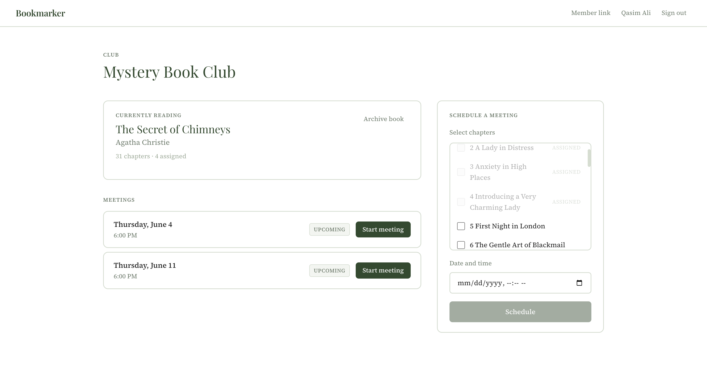
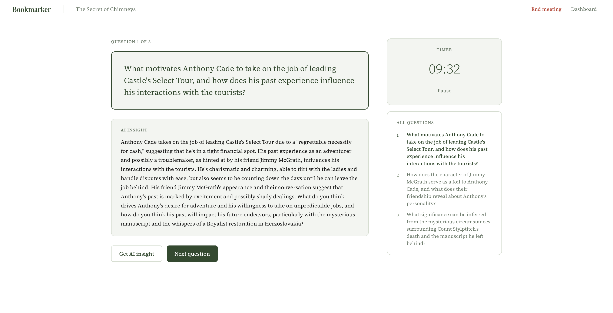
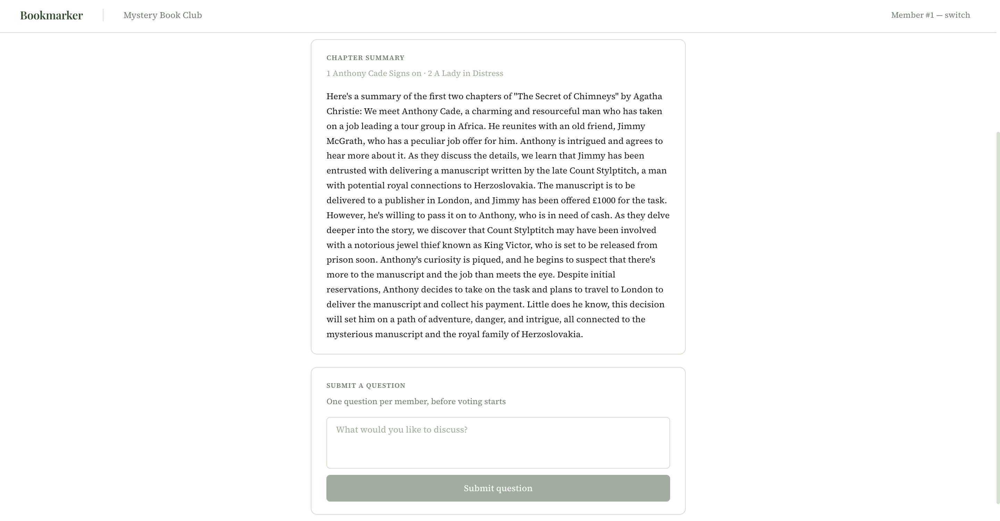

# Bookmarker

A meeting companion for in-person book clubs. The leader manages everything through a dashboard; members join via a persistent link with no account required.

**[Live Demo →](https://bookmarker-qasim.vercel.app)**

---







---

## How It Works

```
Leader uploads EPUB → chapters parsed automatically
                    → meetings scheduled with chapter assignments
                    → leader opens meeting room
                    → members submit questions + get AI summary
                    → leader starts voting
                    → members like questions
                    → top 3 by votes selected for discussion
                    → per-question timer + AI insight on demand
                    → meeting ends, both sides see finished page
```

The leader authenticates with Google. Members never create an account — they pick their name from a list or join as new on first visit, and the app remembers them through a persistent club link.

---

## Features

**Leader**
- Upload any EPUB — title, author, and chapters parsed automatically from `toc.ncx` metadata
- Schedule meetings with chapter assignments; assigned chapters are permanently greyed out so they can't be double-booked
- Toggle AI question generation on or off before starting voting
- See all questions during voting without vote counts visible (revealed on end voting)
- Top 3 questions selected automatically by vote count, tie-broken by submission order
- Per-question timer with pause/resume during discussion
- AI insight generated on demand for any discussion question
- Archive finished books; upload a new one to start the next cycle

**Members**
- Join via a shareable link, no account needed
- Mark attending and done reading per meeting from the home view
- Get an AI-generated catch-up summary of assigned chapters
- Submit one discussion question before voting starts; submissions are hard-rejected server-side once voting begins
- Like questions during voting; likes are the votes
- See the discussion question list during the meeting

**Meeting phases:** `upcoming → started → voting → discussing → finished`

Member pages transition between phases automatically via 5-second polling — no refresh needed.

---

## Engineering

**Real-time sync without WebSockets.** Member pages poll a single `/api/meeting-status` endpoint every 5 seconds. The key design decision was to return status, current question index, and the relevant question list in one atomic response. An earlier approach made separate fetches for status and questions and tried to correlate them client-side — if the questions hadn't loaded yet when the status poll fired, the index lookup failed silently and members got stuck on the wrong question. Combining everything into one response eliminated the race condition entirely.

**EPUB parsing from scratch.** Rather than relying on a high-level EPUB library, chapters are extracted directly from the `toc.ncx` navigation file using `adm-zip` and `fast-xml-parser`. This gives precise control over chapter ordering, title extraction, and filtering out non-content entries like license pages and table of contents. The first 8,000 characters of each chapter's content are stored and used as context for all AI features.

**AI woven throughout.** Groq's `llama-3.3-70b-versatile` powers four distinct features: chapter summaries, discussion question generation, per-question insights during discussion, and next book suggestions. All prompts return structured output (JSON arrays or plain prose) with explicit format instructions to avoid parsing failures. If question generation returns anything other than exactly 5 items, the leader is shown an error and asked to retry rather than silently proceeding with a broken state.

**Hard server-side cutoffs.** Member question submissions are rejected at the API level once a meeting moves past the `started` phase — not just hidden in the UI. The server checks meeting status on every submission request, so a member sitting on a stale page can't sneak a question in after voting has started.

---

## Stack

**Frontend:** Next.js 15 (App Router) · TypeScript · Source Serif 4 + Playfair Display  
**Backend:** Next.js API routes · Drizzle ORM · Neon (serverless Postgres)  
**Auth:** NextAuth v5 · Google OAuth (leader only)  
**AI:** Groq SDK · llama-3.3-70b-versatile  
**Storage:** Vercel Blob (EPUB files)  
**Deployment:** Vercel